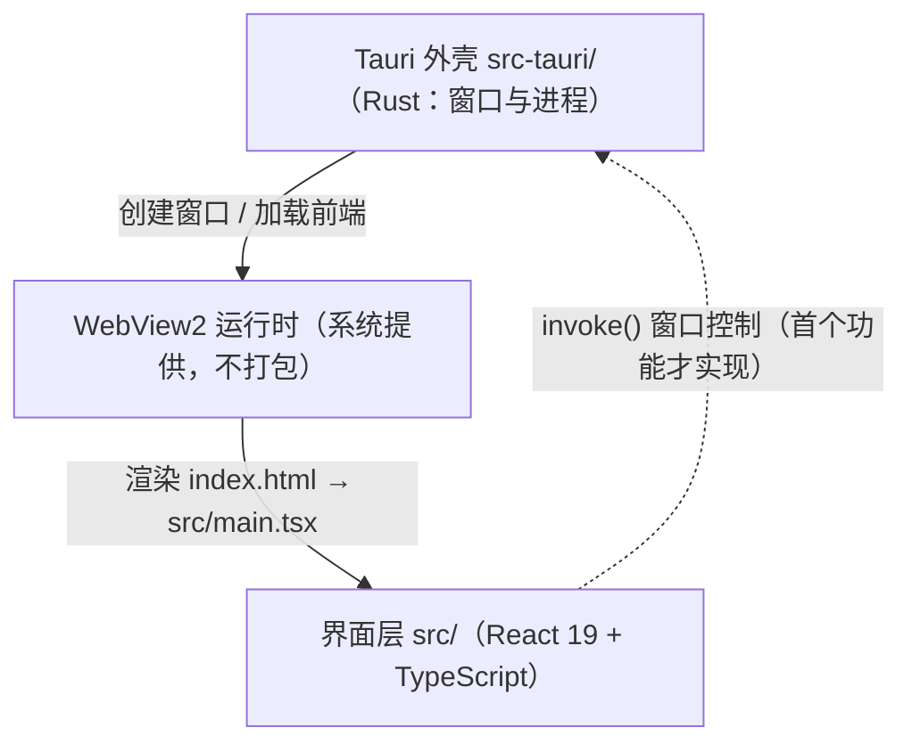

# ARCHITECTURE · 架构总览（≤150 行；agent 写代码前必读）
> 最近核对 —（骨架未核对；核对后填 <日期> @ <提交哈希>）
> 本文件回答六件事：系统由什么组成 / 数据怎么流 / 新代码放哪 / **边界画在哪** / **谁关注什么** / **拿什么换什么**。
> 模块结构变了必须更新本文件（归档卡会查）。改不动上限 = 该拆模块了。
> **怎么填**：每处 `<…>` 都标了"由哪张卡的哪个动作填"。没走到那张卡就**留空不算违规**——S 档只有一个文件时，本文件原样保留即可。
> 一旦要填，就填成"照着念能复现"：目录写真实相对路径，框架写真实名字（版本以 `.tool-versions` 为准）。
> §6~§8 是 **3-7 架构定义卡**的产物（项目首次成型 / 结构变更时走）；§1~§5 是更早就在用的部分。两者不重复：§1~§5 讲"长什么样"，§6~§8 讲"为什么长这样"。

## 1. 模块图（1-2 卡选型确定后画；mermaid 语法可直接渲染）

- 本项目**无后端、无数据库、无第三方服务**，按「删比留空准」已删除 API / DB / EXT 三行。
- 实线 = 脚手架当前已具备；虚线 = 尚未实现的调用路径（透明置顶、鼠标穿透、拖拽等窗口控制命令是 2-1 卡的产物）。

## 2. 分层说明（1-2 卡定目录时逐行填；每层一行：放什么）

| 层 | 目录 | 放什么 |
| :-- | :-- | :-- |
| 外壳层 | src-tauri/ | Tauri 配置 `src-tauri/tauri.conf.json`、Rust 入口 `src-tauri/src/main.rs` 与逻辑入口 `src-tauri/src/lib.rs`、窗口控制命令；**唯一碰操作系统 API 的地方** |
| 界面层 | src/ | React 组件、样式、角色渲染与动画（当前只有脚手架演示页 `src/App.tsx`，挂载点 `src/main.tsx`） |
| 静态资源 | public/ | 构建期原样拷贝到产物根的静态素材 |

- 本项目已合并掉接口层 / 数据层：无服务端、无数据库，故两行按「删比留空准」删除。
- **路径一律写全**：本文件写裸文件名（如只写 `main.rs`）会被 `orphans.ps1` 判为「文档幽灵」——搜索词要能一次命中真实文件。

## 3. 数据流（3-1 卡定；两条真实链路，逐行都是本项目的名字）

**链路 A · 光标跟随与透明区穿透（每 16.7 ms 一次，全项目唯一的定时器）**

1. `src/interaction/useCursorFollow.ts` 的 `setInterval` 触发 → `invoke('plugin:window|cursor_position')`（无参数，返回 `{x,y}` 或 `null`）→ 得到 `cursorScreen`
2. 同一个 tick 内：`gazeAngle(dx, dy)`（`src/interaction/gaze.ts`）算出 `gazeDeg`；`screenToViewport()` + `isOverCharacter()`（`src/interaction/hitTest.ts`，几何取自 `src/character/geometry.ts` 的 `CAT_GEOMETRY`）算出 `overCharacter`
3. 写回界面层：`gazeDeg` 变化才写进 CSS 自定义属性驱动瞳孔；`overCharacter` 在**翻转时**才 `invoke('plugin:window|set_ignore_cursor_events', {label, value})`
4. 失败分支：`cursor_position` 返回 `null` → 瞳孔回正 0°、穿透开关保持上一次取值（错误码 `E-IPC-02`，见 `docs/registry/APIS.md`）

**链路 B · 用户操作（事件驱动，无轮询）**

1. 左键 `mousedown` 命中猫身 → `useDragExit.onMouseDown` → `invoke('plugin:window|start_dragging', {label:'main'})`（阻塞式，SCOPE U4）
2. 右键 `contextmenu` → `Menu.new()` + `MenuItem.new('退出')`（`plugin:menu|new`）→ `popup()`（`plugin:menu|popup`）
3. 菜单项 onClick → `invoke('plugin:window|close', {label:'main'})` → 窗口关闭、进程退出
4. 失败分支：ACL 未授权 → Promise reject → `console.error` 打 `E-IPC-01`，**功能失效由门禁拦**（`src/tauriConfig.test.ts` 的 `acl OK 4/4`），不靠运行时兜底

- 本项目**无数据层、无接口层**：链路里没有数据库读写、没有 HTTP 往返。全部状态是进程内瞬时值（`docs/specs/2026-10-06_desktop-pet/DESIGN.md` §2）。

## 4. 新代码落点表（3-1 卡定方案时填；新建文件前必查，找不到就问，禁止乱放）

| 改动类型 | 放哪 |
| :-- | :-- |
| 角色渲染与动画（SVG 组件 / 几何常量 / keyframes 样式） | `src/character/`（**3-1 卡定名**：`HeiCat.tsx` / `geometry.ts` / `heicat.css`；动画一律合成层属性） |
| 交互逻辑与 hook（抽样、命中、拖拽退出） | `src/interaction/`（**3-1 卡定名**：纯函数 `gaze.ts` / `hitTest.ts` 与 hook 分文件；纯函数不得 import `.tsx`） |
| 装配层（把角色与 hook 拼起来） | `src/App.tsx`（唯一装配点；hook 的返回值为参数传给下一个 hook，不许各自直连全局） |
| 新窗口控制命令（Rust） | `src-tauri/src/`（命令注册进 `src-tauri/src/lib.rs`） |
| 新静态素材 | `public/`（**本项目禁止入库任何位图形象素材**，NFR `security` S5：入库的官方素材数 = 0） |
| 新脚本 / 工具 | `scripts/`（**2026-10-06 已建立**；2-4 卡登记第 1 个：`scripts/nfr.ps1` = 六维非功能阈值的检查命令，`-Check <perf\|capacity\|availability\|security\|maintainability\|compat\|all>`；新脚本一律先在此登记再落盘） |
| 窗口 / 打包配置 | `src-tauri/tauri.conf.json`（3-1 卡定下 6 个键的终值，见 `DESIGN.md` §3.4） |
| 能力授权 | `src-tauri/capabilities/default.json`（3-1 卡定下 5 条，上限也是 5；加授权必须同批加调用方，删调用方必须同批删授权） |
| 测试文件 | 与被测模块同目录、同名前缀（`*.test.ts`），由 `node --test "src/**/*.test.ts"` 收集 |
| 环境变量 | `.env`（真实值）/ `.env.example`（键名）——本项目当前无需任何环境变量 |

- 已删除两行（无对应物）：「新接口」「新表/字段」——本项目无服务端、无数据库。

## 5. 非功能需求与威胁建模落点（2-4 / 3-2 卡产物；先定阈值与威胁，再写代码）

| 要落的东西 | 产物路径 | 谁写（卡号） | 什么时候写 | 验证方式（必须可测） |
| :-- | :-- | :-- | :-- | :-- |
| 非功能需求：性能 / 容量 / 可用性 / 安全 / 可维护 / 兼容 | `docs/specs/<日期>_<slug>/NFR.md`；受影响的模块约束回写本文件 §1~§4 | 2-4 卡（阈值由用户确认） | 范围确认后、动代码前 | 每条给「可测阈值 + 验证方式」（跑什么命令、看哪个指标）；给不出阈值写 `N/A（理由）`，不许留空 |
| 威胁建模：资产 / 入口 / 信任边界 / STRIDE 六类 | `docs/specs/<日期>_<slug>/THREAT.md` | 3-2 卡（触碰认证、支付、删数据、外部接口时必走） | 设计批准前 | 每条威胁给缓解措施，或显式接受并写理由；新发现的红线域改动进 SCOPE 并升 L 档 |
| 架构约束：模块边界、依赖方向、新代码落点 | 本文件 §1~§4 | 3-1 卡 | 方案确定时 | 写代码前先读本文件；越界与平行新建由 4-2 卡判红 |

- 回写时机：`NFR.md` 定了阈值，同批把受影响的约束写进本文件 §1~§4，并核对 `.tool-versions` 的版本能否满足（例：要求 Node 22 而锁的是 18 → 先改锁定文件再写代码）。
- 不适用时怎么写：某一类确实没有（如纯本地脚本无可用性要求）→ 在 `NFR.md` / `THREAT.md` 对应行写 `N/A（理由）`，理由要能判定，不许留空行。

**2-4 卡定下的模块约束（阈值里"约束了模块怎么做"的行，逐条回写在此；改阈值必须同批改这里）：**

| 约束 | 来自哪一维/哪条阈值 | 落到哪个模块 |
| :-- | :-- | :-- |
| 角色动画只能走**合成层**（`transform` / `opacity`），禁止动画属性触发 layout（`width`/`top`/`left` 之类） | 性能 `perf` 空闲 CPU ≤1%（单核） | 界面层 `src/character/heicat.css` |
| 瞳孔跟随**只允许一个定时器**（60Hz），且仅在数值变化时写 DOM/属性；禁止 `requestAnimationFrame` 全帧重绘 | 性能 `perf` 空闲 CPU ≤1% + 兼容 `compat` | 界面层 `src/interaction/useCursorFollow.ts` |
| 外壳层**不得引入任何网络相关插件/依赖**（`reqwest`、`tauri-plugin-http` 等）；`capabilities/default.json` 授权条目 ≤5 条 | 安全 `security` 零外联 + 最小权限 | 外壳层 `src-tauri/` |
| capability 里**不得保留未被调用的授权**；删授权必须同批删对应的插件注册与 npm 包 | 安全 `security` 最小权限 | `src-tauri/capabilities/default.json`、`src-tauri/src/lib.rs`、`src-tauri/Cargo.toml` |
| 不得使用 WebView2 在 Windows 10 1809 上不支持的特性（本机是 154，但目标下限是 1809 随附版本） | 兼容 `compat` Windows build ≥17763 | 界面层 `src/` |
| 单文件 ≤500 行（测试文件 ≤1000 行）→ 角色、动画样式、交互 hook 必须分文件，禁止堆进 `src/App.tsx` | 可维护 `maintainability` | 界面层 `src/` |
| 应用**不写任何用户目录文件**（不建日志、不建缓存）；若启用 SCOPE S1「位置记忆」，只允许 `localStorage` 一个坐标 | 容量 `capacity` + 安全 `security` | 界面层 `src/interaction/useDragExit.ts` |

**3-1 卡定下的模块约束（设计批准后生效；4-2 代码审查按此复核）：**

| 约束 | 来自 | 落到哪个模块 |
| :-- | :-- | :-- |
| 全项目**只允许一个** 60Hz 定时器；`usePointerPassthrough` 不得自采样，只能消费 `useCursorFollow` 的同一 tick | ARCHITECTURE §5（2-4）+ NFR `perf` P1 | `src/interaction/useCursorFollow.ts`、`src/interaction/usePointerPassthrough.ts` |
| 60Hz 链路上的 IPC **只在值翻转时**调用（`set_ignore_cursor_events` 于 `overCharacter` 翻转时；瞳孔属性于角度变化时），不得逐帧无条件 invoke | NFR `perf` P1 空闲 CPU ≤1% | 同上两个 hook |
| 纯函数（`gaze.ts` / `hitTest.ts`）**不得 import `.tsx`**；几何常量必须住在非 JSX 文件，供纯逻辑与测试共用 | D14① 纯逻辑与副作用分文件 | `src/character/geometry.ts` → `src/interaction/hitTest.ts` |
| 每条 IPC 调用的失败分支必须显式处理，错误码取 APIS.md 的 `E-IPC-01/02/03`；**禁空 catch、禁静默吞错** | D14④ 防御 | `src/interaction/*.ts` |
| capability 授权条目与代码里的实际调用**必须一一对应**（既有 ≤5 条上限，也有"不留未被调用的授权"下限） | NFR `security` S2 | `src-tauri/capabilities/default.json` ↔ `src/interaction/` |

## 6. 边界三问（3-7 卡动作 1；项目首次成型或结构变更时填）

| 问题 | 答案 | 反例（自查用） |
| :-- | :-- | :-- |
| 这是什么（一句话 ≤40 字，不带技术名词） | <谁用它做什么> | "一个用 <框架> 写的站"——说的是实现，不是系统 |
| 不做什么（≥3 条，含最容易被顺手加进来的那条） | <逐条列> | 只写"不做移动端"而漏掉"不做多用户" |
| 外面有什么（外部系统 / 人 / 定时任务，谁主动谁被动） | <逐条列> | 把数据库算成外部系统（它是 §3 的数据层） |

## 7. 干系人与关注点（3-7 卡动作 2；每一行都要有视图认领，没认领就是没做）

| 干系人 | 关注点（他到底担心什么） | 由哪个视图回答 |
| :-- | :-- | :-- |
| 用户 | <打开就能用吗 / 错了知道怎么办吗> | §3 上下文视图 + §3 运行时视图 |
| 未来的我 | <改一处要动几处 / 加功能会不会塌> | §1 模块图 + §8 权衡 |
| 运维的我 | <挂了怎么知道 / 数据丢了怎么回来> | §3 数据视图 + §5 观测 |
| 下一个 agent | <从哪开始读 / 哪些是禁区> | §6 边界三问 + 本表 |

- 单人项目不跳过这一步：这里的"干系人"是**角色**，不是组织架构。

## 8. 质量属性场景与权衡（3-7 卡动作 4~6；阈值不许自己编）

**质量属性场景 ≤5 条**，每条三要素写全（对不上 `NFR.md` 的阈值就写 `暂无阈值（理由）`）：

| 属性 | 刺激（谁在什么条件下触发） | 响应（系统做什么） | 度量（阈值来自哪一行） |
| :-- | :-- | :-- | :-- |
| <性能 / 可用性 / 可维护 / 安全 / 容量> | <条件> | <行为> | <数字；来源 `NFR.md` 第 N 行 或 `暂无阈值（理由）`> |

**权衡记录 ≥3 条**，每条写成一行：`选了 X ｜ 换来 Y ｜ 代价 Z ｜ 什么时候翻案`：

| 选了 | 换来 | 代价 | 翻案条件 |
| :-- | :-- | :-- | :-- |
| <方案> | <好处> | <付出去的东西> | <出现什么信号就回头改> |

**演化口子 ≥2 条**（现在不做、以后要做时改哪一处，不许写"以后再说"）：

1. <以后要做的事> → 改 <哪个文件 / 哪个模块>
2. <…>

- 依赖方向的铁律（禁双向、禁环、禁跨层）在 §1 模块图上自查；3-7 卡动作 8 的脚本会点名违规。
